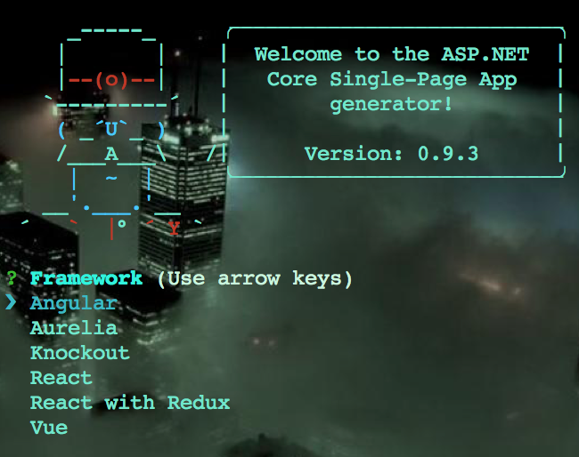

# ASP.NET Core for Single Page App
[Video](https://www.youtube.com/watch?v=C6MPSLgsGGs)
[GitHub Repo](https://github.com/aspnet/JavaScriptServices)
### Terminal Install:
```sh
npm i -g yo generator-aspnetcore-spa
```

A Prebuilt template for creating Single Page Apps using ASP.NET

### Create:
- Create working directory & change into it
```sh
mkdir DESIREDPROJECTNAME ; cd DESIREDPROJECTNAME
```
- Create SPA ASP.NET
```sh
yo aspnetcore-spa
```
- Choose Frontend Framework:

  - Angular
  - Ayrelia
  - Knockout
  - React
  - React with Redux
  - Vue
- Name your project:
```sh
DESIREDPROJECTNAME or whatever
```
- TO RUN SPA YOU JUST CREATED IN PRODUCTION MODE:
```sh
dotnet run
```

- To recompile (in project directory):
```sh
webpack
```

- **_OR_** ADD(Replace current) THIS TO **package.json**:
```js
  "scripts": {
    "start": "ASPNETCORE_ENVIRONMENT=Development dotnet run",
    "test": "karma start ClientApp/test/karma.conf.js"
  },
```

- Launch asp.net SPA with instantly compiled updates with:
```sh
npm start
```
