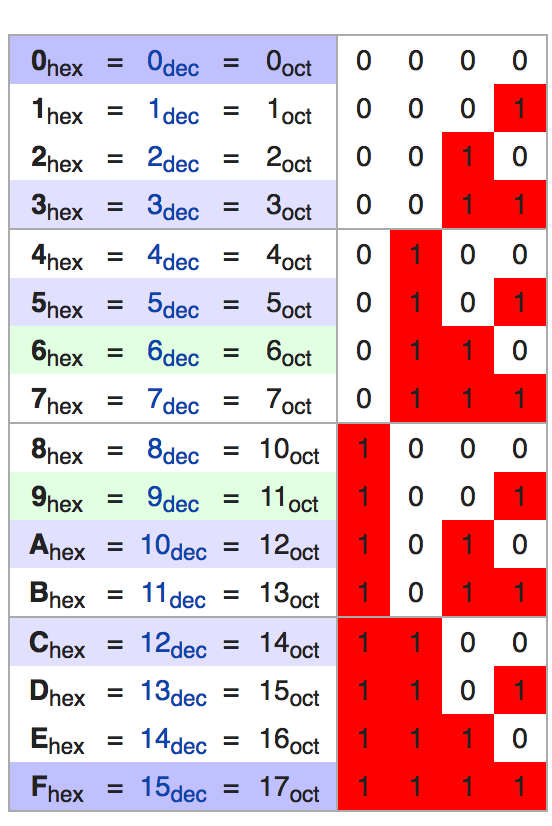
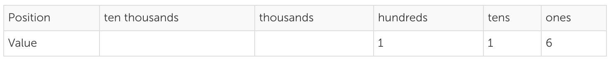

###  [Hexadecimal](https://en.wikipedia.org/wiki/Hexadecimal) (base 16)

- In mathematics and computing, hexadecimal (also base 16, or hex) is a positional numeral system with a radix, or base, of 16.
- It uses sixteen distinct symbols, most often the symbols 0–9 to represent values zero to nine, and A, B, C, D, E, F (or alternatively a, b, c, d, e, f) to represent values ten to fifteen.
- Example:
  - 10 = a
  - 11 = b
  - 12 = c
  - 13 = d
  - 14 = e
  - 15 = f



POWERS FOR EACH GROUP OF 4 [2^3 2^2 2^1 2^0]

BINARY  to convert = [1111 1111 0011]

HEXIDECIMAL CONVERSION = [f     f     3]

---

### [BASE 8](https://en.wikipedia.org/wiki/Octal)

- The octal numeral system, or oct for short, is the base-8 number system, and uses the digits 0 to 7.
- Octal numerals can be made from binary numerals by grouping consecutive binary digits into groups of three (starting from the right). For example, the binary representation for decimal 74 is 1001010.
- Two zeroes can be added at the left: (00)1 001 010, corresponding the octal digits 1 1 2, yielding the octal representation 112.


Groups of 3 = int between 0-7
Exponentially = 2^2 2^1 2^0

BINARY TO CONVER = 101 100
AS BASE =  401 400 = 54_base_8

---

### [Binary](https://en.wikipedia.org/wiki/Binary_number)

Binary is a base 2 number system (0,1)

Describe how digits are assigned values using base to the exponent notation

Convert binary-to-decimal and decimal-to-binary


`1 1 0 1 0 0 1`
42-base-5


---

FROM THE GALV ARTICLE
# Binary

### Objectives:

- Define Bits and Bytes
- Convert Decimal to Binary and Hexadecimal Numbers
- Describe UTF-8 and ASCII, including the differences between the two

Since the bits 1 and 0 aren't that useful, they are more often used in 8-bit chunks called bytes. To see a bunch of random bytes, run this in node:

```js
const crypto = require('crypto')
let bytes = crypto.randomBytes(16)

for (var i = 0; i < bytes.byteLength; i++) {
  let binaryRepresentation = bytes[i].toString(2)
  console.log("0".repeat(8 - binaryRepresentation.length) + binaryRepresentation);
}
```
OUTPUTS:
```sh
10110110
00101111
00000101
01010001
01011001
01001001
01011101
00110111
00100011
10011110
00011001
01101001
00101100
11111001
10001011
10001100
```

Numeric values can be represented in any base, though we are most familiar with decimal (using digits 0-9 to represent numbers). Binary represents numeric values with only zero and one.

###### SIDE NOTE ON _base_ :
`https://simple.wikipedia.org/wiki/Base_(mathematics)`
-  In mathematics, a base or radix is the number of different digits or combination of digits and letters that a system of counting uses to represent numbers.
  - For example, the most common base used today is the decimal system.
    - Because "dec" means 10, it uses the 10 digits from 0 to 9.)

If you remember back to grade school a number like 116 was taught as follows:

