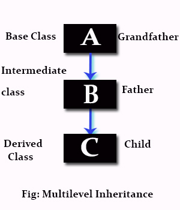

## Inheritance:
[MDN CLASS VS PROTOTYPE](https://developer.mozilla.org/en-US/docs/Web/JavaScript/Guide/Details_of_the_Object_Model)

- Inheritance is when an object or class is based on another object (prototypal inheritance) or class (class-based inheritance).
- Using the same implementation (inheriting from an object or class: inheriting behavior, programming by difference[1]) or specifying a new implementation to maintain the same behavior (realizing an interface).

- Such an inherited class is called a subclass of its parent class or super class.

- It is a mechanism for code reuse and to allow independent extensions of the original software via public classes and interfaces.

- The relationships of objects or classes through inheritance give rise to a hierarchy.

- The term "inheritance" is loosely used for both class-based and prototype-based programming, but in narrow use is reserved for class-based programming (one class inherits from another), with the corresponding technique in prototype-based programming being instead called delegation (one object delegates to another).

### Types:
##### There are various types of inheritance, based on paradigm and specific language.

- Single inheritance
  - where subclasses inherit the features of one superclass. A class acquires the properties of another class.

- Multiple inheritance
  - where one class can have more than one superclass and inherit features from all parent classes.

- Multilevel inheritance:
  - where a subclass is inherited from another subclass.
  - It is not uncommon that a class is derived from another derived class as shown in the figure "Multilevel inheritance".

  - The class A serves as a base class for the derived class B, which in turn serves as a base class for the derived class C.
  - The class B is known as intermediate base class because it provides a link for the inheritance between A and C.
  - The chain ABC is known as inheritance path.

This process can be extended to any number of levels.

- Hierarchical inheritance:
  - where one class serves as a superclass (base class) for more than one sub class.
- Hybrid inheritance:
  - A mix of two or more of the above types of inheritance.

- Parent object has children that gains properties from parent and children can have their own properties
