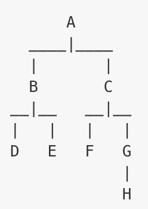
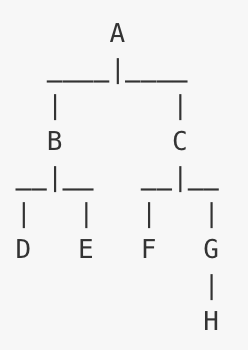

# [Recursion](https://en.wikipedia.org/wiki/Recursion_(computer_science))

[Recursion](http://www.sparknotes.com/cs/recursion/whatisrecursion/section1.rhtml)
- Recursion is a technique where a method can call itself.
- Recursion can be used to traverse tree structures.
  - For example, take the following tree, where each letter represents a node in the tree:


#### In this tree, we can say that:

- `A` is the `root node`
- `A` has two `child nodes`: `[B, C]`
- `B` has two `child nodes`: `[D, E]`
- `C` has two `child nodes`: `[F, G]`
- `G` has one `child node`: `[H]`

#### How tree-traversal:
Let's say you wanted to go over the entire tree and print the letters out... you could write (pseudo) code like this:

```
print the root node's letter
for each child node in the root node's children
  print the child node's letter (B, C)
  for each child in the child node's children
    print the granchild's letter (D,E,F,G)
    for each child in the grandchild's children
      print the letter (H)
```

- You can see that this only works if the tree has 4 levels.
  - But what if it had 8 levels?
  - Or 100? Basically that code is doing the same thing, but from a different starting point:

  - Start with `A`, print `A`'s letter
  - Go over all of `A`'s children and repeat step 1, but start with `B`, then with `C`

- We could write that in JavaScript like so:

```js
function printLetters(node) {
  console.log(node.name);
  node.children.forEach(function(childNode){
    printLetters(childNode);
  });
}
```

#### For recursion we need:

- A base case(s)
- Recursive step
- The recursive step ensures that we progress.
  - The base case ensures that our recursion eventually exits, preventing an infinite loop.
  - Also we usually want to pass some data/information around - we do this with function returns.


### Approach (1) - Start at the bottom

- Pretend you are at the solution

  - For example:
    - This can be a node you are searching for
    - The end of a recursive data structure

- How do you know you found the solution (what's your base case)

- Now that you have you answer, how do you get this answer back to the top

- Since you have solved the problem, assuming you are at the solution...

- How do you get to the solution
  - Easier to think one step at a time
  - How do I go one step further
  - If you know how to get from one step to the next, and know when to stop...

### Approach #2 - Identify sub-problems

- Often times recursive problems require you to split a big problem into smaller problems.
- For example, let's say you were trying to write a recursive function that would find the first element of an array greater than a specific number. The `for` loop would look like this:
```js
function firstGt(array, number) {
  for (var i = 0; i < array.length; i++) {
    if (array[i] > number) {
      return array[i];
    }
  }
}
```

- Here, you could split this into two sub-problems:
  - Problem #1 is to take the first element of the array and see if it's bigger.
  - Problem #2 is to take the rest of the array (all except the first element), and repeat Step #1.
```js
function firstGt(array, number) {
  if (array[0] > number) {
    return array[0];
  } else {
    return firstGt(array.slice(1), number);
  }
}
```

---

## LISA LECTURE

### [Recursion](https://learn.galvanize.com/content/gSchool/computer-science-curriculum/master/Unit-1/04-recursion.md)
[Recursion info](http://www.sparknotes.com/cs/recursion/whatisrecursion/section1.rhtml)
https://en.wikipedia.org/wiki/Recursion_(computer_science)


### [fibonacci](https://en.wikipedia.org/wiki/Fibonacci_number)

### Recursive function:
(call a function inside of a function to reduce the input each time)

- Recursion is a technique where a method can call itself.
  - Recursion can be used to traverse tree structures.
  - For example, take the following tree, where each letter represents a `node` in the tree:


In this tree, we can say that-

`A` is the **root** node
`A` has _two_ **child** nodes: `[B, C]`
`B` has _two_ **child** nodes: `[D, E]`
`C` has _two_ **child** nodes: `[F, G]`
`G` has _one_ **child** node: `[H]`


- To go over the entire tree and print the letters out, you could write (pseudo) code like this:
```
print the root node's letter
for each child node in the root node's children
  print the child node's letter (B, C)
  for each child in the child node's children
    print the granchild's letter (D,E,F,G)
    for each child in the grandchild's children
      print the letter (H)
```

- You can see that this only works if the tree has 4 levels.
  - But what if it had 8 levels, 100?
  - Basically that code is doing the same thing, but from a different starting point:

- Start with A, print A's letter
- Go over all of A's children and repeat step 1, but start with B, then with C


#### Structure
The recursive step ensures that we progress. The base case ensures that our recursion eventually exits, preventing an infinite loop. Also we usually want to pass some data/information around - we do this with function returns.

- Recursive Case:
  - Action
  - Recursive call w/ reduced input size
    - invoke the function with a smaller input

- Base Case:
  - When to stop


Define a recursive function that returns true if a string is a palindrome and false otherwise.


```js
function isPalindrome(string) {

  if(string.length <= 1) return true; // 1

  if(string.charAt(0) != string.charAt(string.length - 1)) return false; // 2

  return isPalindrome( string.substr(1, string.length - 2) ); // 3
}

isPalindrome('anna'); // true
isPalindrome('ana'); // true
isPalindrome('a'); // true
isPalindrome('lucy'); // false
isPalindrome('anya'); // false
```

### EXAMPLE OF RECURSION
```js
var value = 2568,
    sum = 0;

while (value) {
    sum += value % 10; // ACTION
    value = Math.floor(value / 10);
}

console.log(sum);
```

The second function uses the modulo operator to extract the last digit:
```js
  1236 % 10
= 1236 - 10 * floor(1236 / 10)
= 1236 - 1230
= 6
```
When the last digit is extracted, it is subtracted from the number:
```js
  1236 - 6
= 1230
```
And the number is divided by 10:
```js
  1230 / 10
= 123
```
Each time this loop repeats, the last digit is chopped off and added to the sum.

The modulo operator returns the single digit if the left hand side is smaller than the right (which will happen for any 1-digit number), which is when the loop breaks:
```js
  1 % 10
= 1
```
This is how the leading digit gets added to the total.
