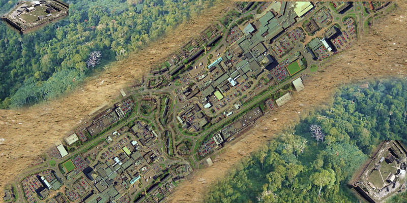

# COLONY
## LONG SERVER USE:

ENDS ON COMPLETION:
  - COLONIES UNITE AND WIPE OUT AI
    - ?(? HOW TO HANDLE AI SPAWN / WIN || WIPE OUT?)?
    - This triggers rescue (DEPENDING ON STORY TYPE VIKING BOAT, MODERN HELICOPTER ETC)
  - COLONY ERADICATES OPPOSING COLONY
  - AI WINS:
    - COLONIES COULDN'T SURVIVE INCREASINGLY LARGE WAVES OF AI (ATTRACTED BY NOISE)
 - Possibility of NEVER ENDING GAME?

MAP DESIGN:

2 Teams (RED && BLUE) start diagonally opposing sides:
Diagonally running across the map is the **CITY/ town / mall / Other cool spot** with salvageable items Example:

- **CITY** is filled with /vikings/ soldiers/ zombies/ mutants/ aliens (IDK what else YET)
  - Hostile AI

PLAYERS will:
- Start with nothing (LIKE Minecraft/RUST)
- Must scavenge surroundings for goods /resources / tools/ random drops (weapons, usefull items etc)
- Must create tools
  - once tools are built
  - Ability to build objects
- create fortifications / fortress
  - The fortress will serve as a spawn point
    - GameObject called armory/safe will hold dropped items when you die
      - Once able to find and return to fortress With A pre-made safe
      - Able to Forge safe once tools and skills have been built (Kiln, Metallurgy skills etc)
