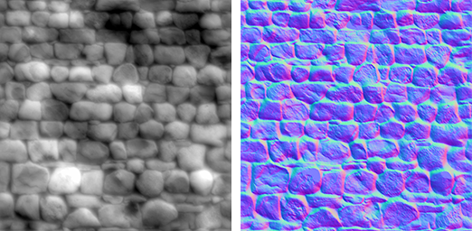
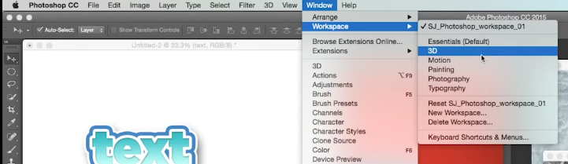
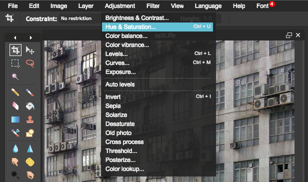
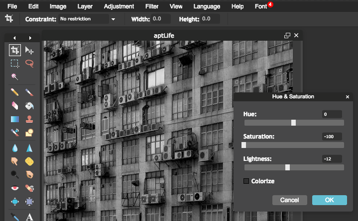
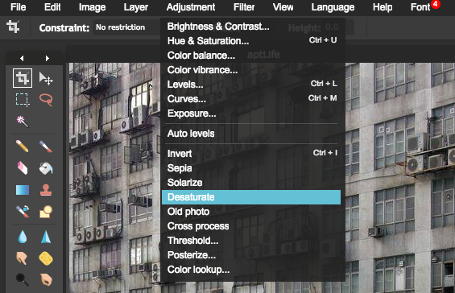

# Bump Map
[Good breakdown](https://www.youtube.com/watch?v=yHzIx41eiD4)
[How to](https://www.pluralsight.com/blog/tutorials/tips-creating-perfect-normal-maps-every-time)
### Description:
- Black & White image that simulates height and depth
  - No added complexity to 3D Mesh / Model Geometry

### Bump Map, Normal Map and Height Map Differences:
- Normal Maps and Height Maps are both types of Bump Map.
  - They both contain data for representing apparent detail on the surface of simpler polygonal meshes, but they each store that data in a different way.

- Height Map (Left):
  - A `height map` is a simple black and white texture, where each pixel represents the amount that point on the surface should appear to be raised.
  - The whiter the pixel color, the higher the area appears to be raised.

- Normal Map (Right):
  - An RGB texture, where each pixel represents the difference in direction the surface should appear to be facing, relative to its un-modified `surface normal`.

---
### How to:

1. #### [_Photoshop cc 2015 tutorial_](https://www.youtube.com/watch?v=_3CG-lzy0RA)
Mac top toolbar: **Window => Workspace => 3D**

  - 3D Workspace allows for simplified Bump & Normal Map creation
  - Simplify Mesh(es)
2. #### [Pixlr.com](https://pixlr.com/editor/) _free online editor_:
  1. Pixlr Toolbar: **Adjustment => Hue & Saturation**
  
    - Adjust`Saturation` to `-100`
    - Adjust `Lightness` as needed
        - _This allows for more control (`Lightness`) than the following `Desaturate` method._
  

  - Pixlr Toolbar: **Adjustment => Desaturate**
  
    - Simple way to create a Black & White image

---
