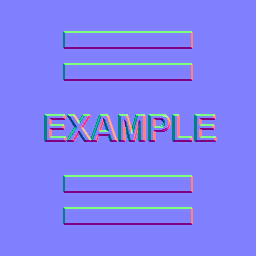
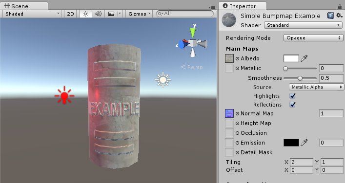

# Normal Map
**[Unity Docs Normal Map (Bump mapping)](https://docs.unity3d.com/Manual/StandardShaderMaterialParameterNormalMap.html)**
- Normal maps are a type of Bump Map.
- Texture that allows addition of surface detail (bumps, grooves, and scratches) to a model
- Catch light as if they are represented by real geometry

### Surface Normals
An example of a `normal`:
A model where each surface polygon is lit simply according to the surface angles relative to the light.
The surface angle can be represented as a line protruding in a perpendicular direction from the surface, and this direction (which is a `vector`) relative to the surface is called a `surface normal`, or simply, a `normal`.

###Description:
`Normal mapping` is the modification of `surface normals` by using a texture to store information about how to modify the `surface normals` across the model.

A `normal map` is an image texture mapped to the surface of a model
Each pixel in the texture of the `normal map` (called a `texel`) represents a deviation in `surface normal` direction away from the _true_ `surface normal` of the flat (or smooth interpolated) polygon.

- The colors in a raw `normal map` file have a blueish hue, and don’t contain any actual light or dark shading
- The RGB values of each `texel` represent the `X,Y & Z values` of a direction vector, and are applied as a modification to the basic interpolated `smooth normals` of the polygon surfaces.

This `normal map` can be imported into Unity and placed into `Normal Map` slot of the `Standard Shader`. When combined in a material with a color map (the `Albedo map`) and applied to the surface of a mesh, the result looks like this:

