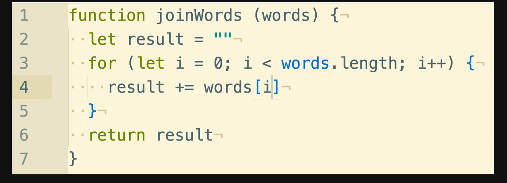

# Accumulator Patterns
##### [Help from: tjcut](https://github.com/tjcutt)
###### Theory & Code for each (Vanilla and Actual method)
---
##### To write an algorithm using the accumulator, here are the basic steps:

- Define the functions
- Declare and return the result variable
- Set up the iteration
- Alter the accumulator as necessary
---
## Patterns:

- #### filter ✅
  - The ```.filter()``` method creates a new array with all elements that pass the test implemented by the provided function.
  - ##### Syntax
  ```javascript
  var newArray = arr.filter(callback[, thisArg])
  ```
   thisArg Optional Value to use as this when executing callback.

  - Vanilla
  ```javascript
  let filter = (array, callback) => {
  let arr = []
  for (let item of array) {
      if (callback(item)) {
        arr.push(item)
      }
  }
    return arr
  }
  ```
---  
- #### map ✅
  - The ```.map()``` method creates a new array with the results of calling a provided function on every element in this array.
    - ##### Syntax
      ```  javascript
      var new_array = arr.map(callback[, thisArg])
       ```
    - Example of actual ```.map``` method
      ```javascript
      var numbers = [1, 5, 10, 15];
      var roots = numbers.map(function(x) {
        return x * 2;
      });
        // roots is now [2, 10, 20, 30]
        // numbers is still [1, 5, 10, 15]  
        ```
    - Vanilla
      ``` javascript
      let map = (array, callback) => {
      let arr = []
      for (let item of array){
        arr.push(callback(item))
      }
      return arr
      }
      ```
---
- #### join ✅
  - The ```join()``` method joins all elements of an array (or an array-like object) into a string.
   - ##### Syntax
``` javascript
  arr.join()
  arr.join(separator)
  ```
    - Vanilla
  
  ``` javascript
    let join = (array, separator) => {
    let string = ''
    for (var i = 0; i < array.length; i++) {
      let item = array[i].toString()
      i < array.length - 1 ? string += item + separator : string += item
    }
    return string
    }
  ```
---

- #### toSentence (last objects have 'and') ✅
  - The ``` slice()``` method returns a shallow copy of a portion of an array into a new array object selected from begin to end (end not included). The original array will not be modified.
   - ##### Syntax

``` javascript
arr.slice(begin, end)

let toSentance = arr.slice(0, arr.length - 1).join(', ') + ", and " +  arr.slice(-1).toString();
```
  - Vanilla
```javascript
  let toSentence = (items) => {
   let string = ''
   for (var i = 0; i < items.length; i++) {
     let word = items[i]

     if (i === items.length-2){
       string += `${word} and `
     }else if (i === items.length-1){
       string += `${word}`
     }else {
       string += `${word}, `
     }
   }
   return string
 }
 ```
---
- #### some✅
  - The ```some()``` method tests whether some element in the array passes the test implemented by the provided function.

  - ##### Syntax

    ``` javascript
    arr.some(callback[, thisArg])
    ```
    - Vanilla
    ```javascript
      let some = (array, callback) => {
      for (let num of array){
        if (callback(num)){
          return true
        }
        }
        return false
      }
      ```
---
- #### every ❌
  - The ``` ```

  ##### Syntax

  ``` javascript
  //addinfo
  ```
   - Vanilla
```javascript
  let every = (array, callback) => {    
    for (let item of array) {      
      if (!callback(item)){            
        return false      
      }      
    }
    return true    
   }
```

---
- #### None ❌

```javascript
let none = (array, callback) => {
  for (let item of array){
    if (callback(item))
    return false
  }
  return true
}
```
---

- #### sum ❌

```javascript
let sum = (array) => {
  let total = 0
  for (let num of array) {
    total += num
  }
  return total
}

```
---

- #### min ❌

```javascript
let min = (array) => {
   let smallest = null
   for (let i = 0; i < array.length; i++) {
     let num = array[i]
     if (smallest === null || num <= smallest){
       smallest = num
     }
   }
   return smallest
  }
```
---

- #### max ❌

```javascript
let max = (array) => {
 let largest = null
 for (let i = 0; i < array.length; i++) {
   let num = array[i]
   if (largest === null || num >= largest){
     largest = num
   }
 }
 return largest
}
```
---

- #### average ❌

```javascript
let average = (array)=>{
  let total = 0
  for (let num of array){
    total += num
  }
  return total/array.length
}
```
---

- #### leftpad ❌

```javascript
let leftpad = (str, len, char) => {
    let string = ''
    if (char === undefined) {
        char = ' '
    }
    str = String(str)
    if (str.length === len || str.length > len) {
        string = str
    } else {
        while (str.length < len) {
            str = char + str
            string = str
        }
    }
    return string
}
```
---

- #### rightpad ❌

```javascript
let rightpad = (str, len, char) => {
  let string = ''
  if (char === undefined) {
      char = ' '
  }
  str = String(str)
  if (str.length === len || str.length > len) {
      string = str
  } else {
      while (str.length < len) {
          str = str + char
          string = str
      }
  }
  return string
}
```
---

- #### indexOf ❌

```javascript
let indexOf = (items, search) => {
  for (var i = 0; i < items.length; i++) {
      let item = items[i]
      if (item === search) {
          return i
      }
    }
    return -1
}

```
---


- #### Group an array of objects by a property ❌❌

- #### Index an array of objects by a property ❌❌
