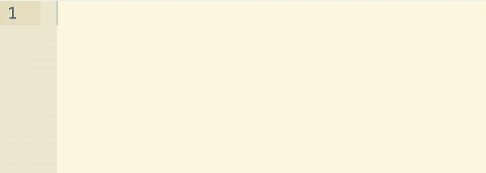
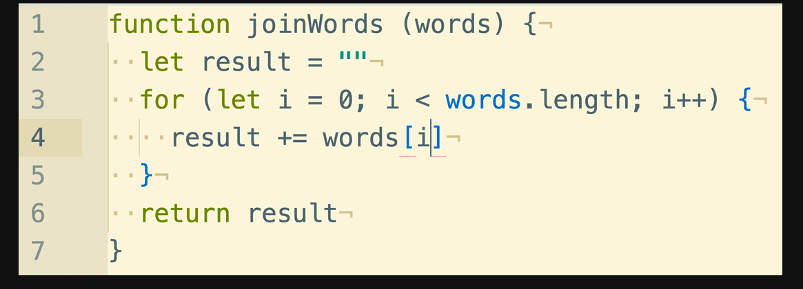

# Accumulator Patterns
###### Theory & Code for each (Vanilla and )
---
##### To write an algorithm using the accumulator, here are the basic steps:

- Define the functions
- Declare and return the result variable
- Set up the iteration
- Alter the accumulator as necessary

---
## Patterns:

- Implement filter
-  map
  - The ```.map()``` method creates a new array with the results of calling a provided function on every element in this array.
    - ##### Syntax

      ```  javascript
      var new_array = arr.map(callback[, thisArg])
        ```
    - Example of actual ```.map``` method
      ``` javascript
      var numbers = [1, 5, 10, 15];
      var roots = numbers.map(function(x) {
        return x * 2;
      });
        // roots is now [2, 10, 20, 30]
        // numbers is still [1, 5, 10, 15]  
        ```

        #### Parameters

        ##### callback
        Function that produces an element of the new Array, taking three arguments:

        currentValue
        The current element being processed in the array.
        index
        The index of the current element being processed in the array.
        array
        The array map was called upon.
        thisArg
        Optional. Value to use as this when executing callback.
        Return value
        A new array with each element being the result of the callback function.


- Implement join



- toSentence (last objects have 'and')

- Implement some

- every

- none

- Implement sum

- min

- max

- average

- Implement leftpad

- rightpad

- indexOf

- Group an array of objects by a property

- Index an array of objects by a property
