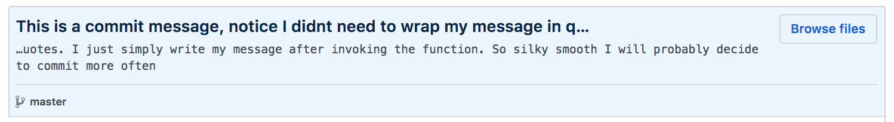

# Automated Git

- Automated Git [ add, commit, & push ] with a simple two letter command `ag`
  - Default commit message (see below) _**OR**_ User defined commit message
- Without text specified after `ag` it will commit with the Default Commit Message:
  - _<Current_User> is committing something on git_
  - No need for quotes around **commit message** but apostrophes are a problem currently. So use bad grammar :D
  - Example Use:
    - $`ag This is a commit message, notice I didnt need to wrap my message in quotes. I just simply write my message after invoking the function. So silky smooth I will probably decide to commit more often`
- **Result:** This is a commit message, notice I didn't need to wrap my message in quotes. I just simply write my message after invoking the function. So silky smooth I will probably decide to commit more often
- Result on GitHub: 

Add the Bash Function below to your Run Commands file if bash: `~/.bashrc` or if ZShell `~/.zrc`

- _**Remeber to refresh your CLI to use**_
  - for bash:`source ~/.bashrc`
  - for Zshell `source ~/.zrc`

```sh
#---------------------------
# AUTOMATGIT ================================================================
# --------------------------
ag(){
  git add -A;
    if [[ -z "$*"  ]]; then
      git commit -m "$USER is committing something on git";
    else
      git commit -m "$*";
    fi
      git push;
}
# ------------------ END AUTOMATGIT --------------------------
```
